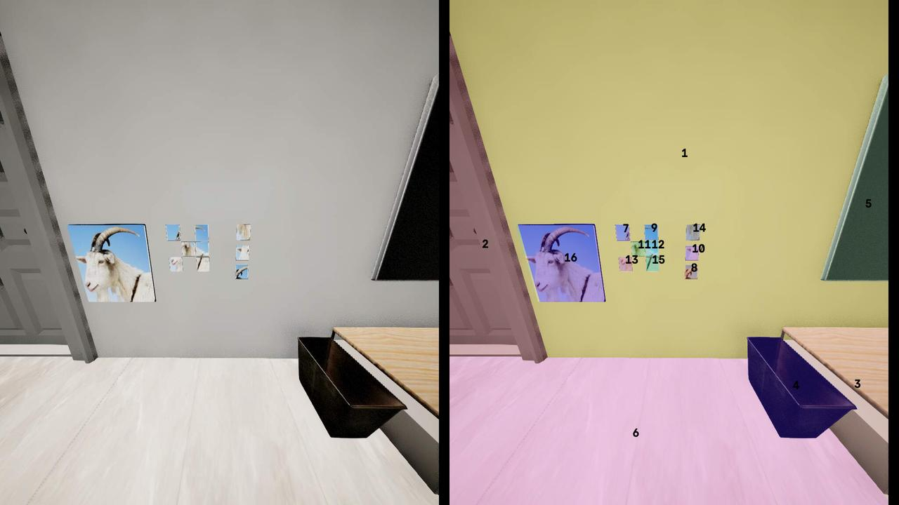
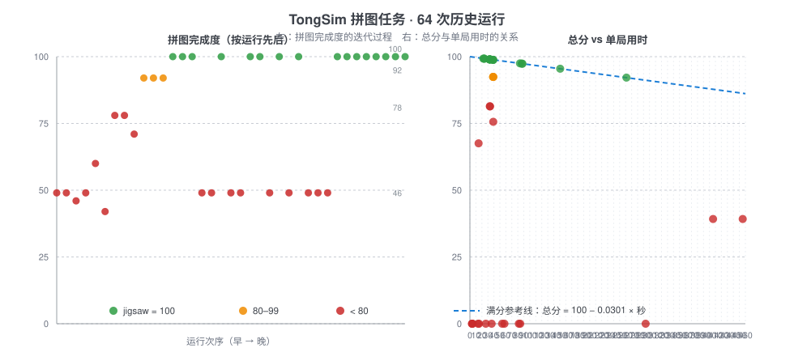
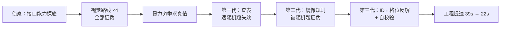
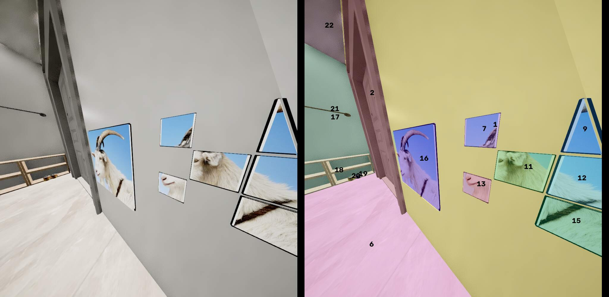
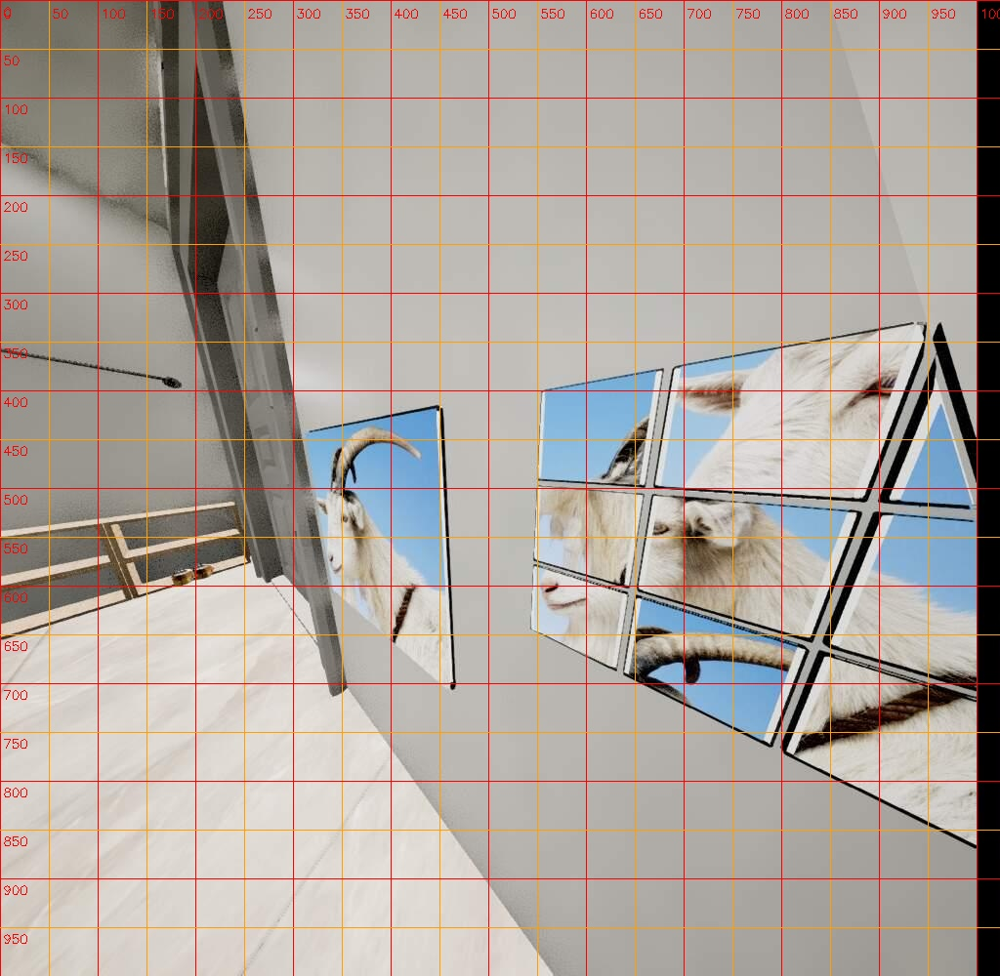
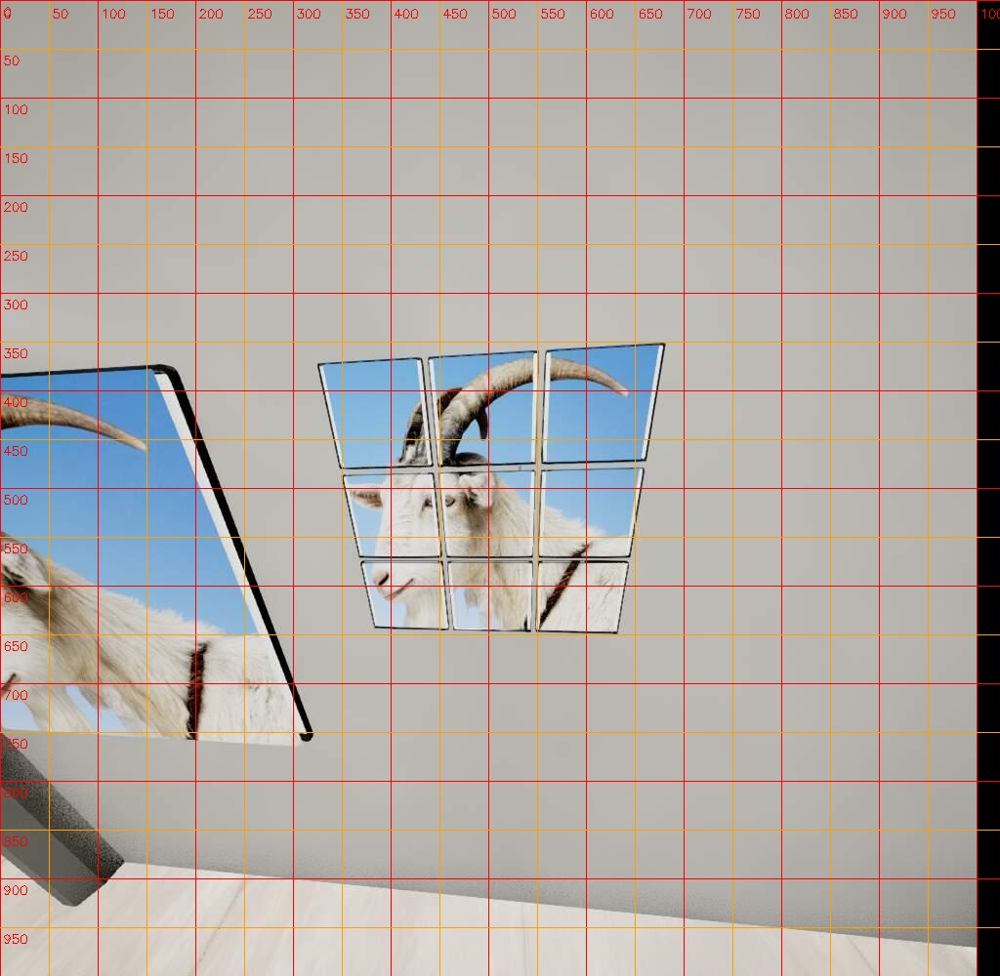
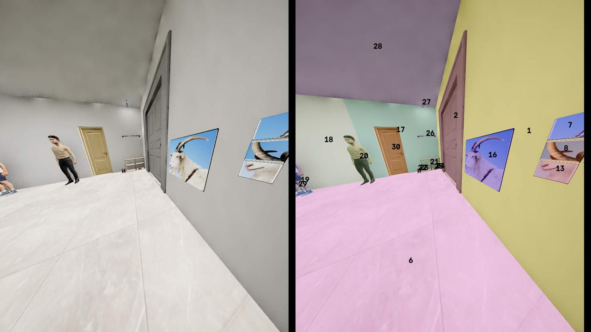
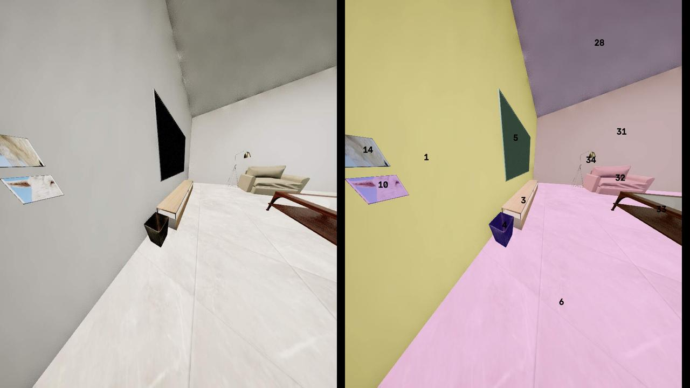
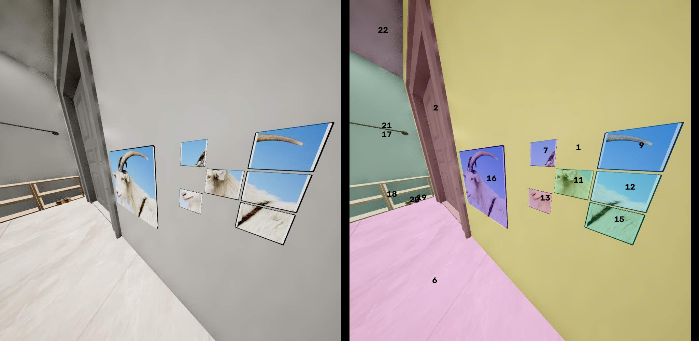
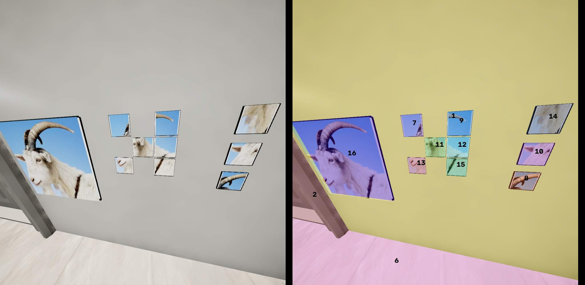

# TongSim 拼图任务智能体

**从黑盒侦察到可证明的确定性解法——一次完整的逆向工程记录**

> 2026 挑战赛初赛 · 拼图任务（`competition-preliminary-jigsaw-task`）
> 环境只有黑盒仿真器：没有任务源码、没有文档说明、没有本地评分反馈。

---

## 结果

| 指标 | 结果 |
| --- | --- |
| 拼图完成度 | **100 / 100**（三块全部正确归位） |
| 单局总分 | **99.28**（时间效率扣 0.72） |
| 单局作答耗时 | **22.3 秒**（优化前 39 秒） |
| 随机题验证 | **5 / 5 全部通过**，含自校验 |
| 打法性质 | **确定性**：不依赖视觉、不依赖概率、不依赖背题 |

## 任务是什么

墙上一块 3×3 拼图板缺了 3 格，同一面墙的货架行上停着 3 块待放拼图，要求把三块放回正确格位。左侧同时给出完整参考图（这是本题"预期"的视觉解法入口，但最终解法完全没用到它）。

几何是每局固定的：墙面 X≈837，三行 Y ∈ {155, 166, 177}、三列 Z ∈ {88, 99, 110}，格距 11；待放块停在 Y=209 的货架行。每局真正变化的只有两件事——**哪三格被掏空**、**块上贴的是哪张图的碎片**。



## 解法内核

```python
rows, cols = 聚类(6 个已放块的 Y 值, Z 值)          # 还原 3×3 网格
base, rflip, cflip = 反解(已放块 id -> 格位)         # 用锚点解出编号规则
assert {预测格位(待放块)} == {三个空槽}              # 强校验，不通过就不落子
for piece in 待放块:
    place(piece, 预测格位(piece), auto_rotate=True)
```

**为什么它是确定性的**：生成器按固定格序逐个生成 9 块，**块的 `object_id` 唯一决定它属于哪一格**。所谓"随机出题"只是随机挑 3 格掏空、把对应的块挪到货架行。所以答案不需要从图像里推断，而是可以直接从场景数据还原。

实测对应关系（每行三格，行 = Y，列 = Z）：

| id | 7 | 8 | 9 | 10 | 11 | 12 | 13 | 14 | 15 |
| --- | --- | --- | --- | --- | --- | --- | --- | --- | --- |
| 格位 (Y, Z) | (155,110) | (166,110) | (177,110) | (155,99) | (166,99) | (177,99) | (155,88) | (166,88) | (177,88) |

注意代码里**没有写死这张表**：它用 6 个已放块现场反解规则参数，并要求三个待放块的预测格位集合恰好等于三个空槽集合，通过才落子。换个题目、换批 id 依然自适应；反解不出来就回退到经验规则，不会硬猜。

## 结果可视化



左图是 64 次历史运行的拼图完成度，能看到 46 → 78 → 92 → 100 的阶梯；右图是总分与单局用时的关系，虚线是完成度满分时的评分参考线（总分 = 100 − 0.0301 × 秒）。

## 方法演进

真正的工作量不在最后那三行，而在这条链上：



| 轮次 | 假设 / 策略 | 验证方式 | 结果 | 判定 |
| --- | --- | --- | --- | --- |
| 1 | 用 `look_at_*` 控制相机取景 | 同站位重复截图算像素差 | 同站位 2–3，换站位 29 | 相机不可控 → 推翻 |
| 2 | 用 `turn_in_degree` 转到固定角度 | 往返同一角度复测 | 偏差 15–21，与不同角度同量级 | 不可复现 → 推翻 |
| 3 | 固定像素框标定采样格子 | 前两轮数据 | 没有稳定取景就没有标定 | 推翻 |
| 4 | 块图案指纹匹配（中心 48×48 直方图余弦） | 同块放不同槽后近距采样 | 同块自洽 0.95+，但无法外推到参考大图 | 不充分 |
| 5 | 接缝连续性度量 | 正确排列 vs 错误排列拍板面近照 | 一个方向 5.2 vs 16.8（3.3×），另一方向无分离 | 不稳定 → 弃用 |
| 6 | 让视觉大模型判"哪组连贯" | 多轮裁剪图 / 整帧判题 | 反复误判，含把错的说成对 | 不可靠 → 弃用 |
| 7 | 暴力求真值：6 种排列逐个实跑 | 用最终得分当信号 | 92 / 78 / 71 / 46 → 最高组即真解 | 采纳（得到真值） |
| 8 | **第一代：查表**（id→格位常量） | 静态题多次复跑 | 100 分 / 总分 98.83–98.98 | 本地成立，遇随机题失效 |
| 9 | **第二代：镜像顺序规则** | 1 个样本 + 无本地验证手段 | 随机题那局把两块对调（2/3 错） | 推翻 |
| 10 | **第三代：ID↔格位反解 + 自校验** | 3 道题场景按 id 对齐 + 反解校验 | 全部吻合，且与第 7 轮真值逐项一致 | 采纳 |
| 11 | 工程提速（等待参数 / 走行排序 / 免拍照） | 每次只改一处、同题前后对比 | 39s → 33s → 24s → 22.3s，98.98 → 99.28 | 采纳 |

每一轮的完整记录（当时的处境、假设依据、实验设计、原始数据、结论、下一步）见 `docs/`。

## 三条最值钱的经验

1. **本地只出一道固定题，会把"背题"伪装成"解题"。** 查表在本地永远满分，直到正式随机题出现才暴露——这是整个项目里最值得记住的教训。
2. **单样本规律 + 无法本地验证 = 高风险假设。** 镜像规则只建立在 1 个样本上，且本地无法打分，结果在随机题上错了 2/3。
3. **不要问"答案是什么"，要问"场景里有没有答案的痕迹"。** 前三代解法都在设法推断答案，第三代换成从场景数据里反解规则，问题才真正消失。

## 截图证据

**相机取景不可控**：同一站位、只改瞄准点（`look_at_location` → `look_at_object`），画面几乎逐像素相同（mean|diff| 2–3）——所以"固定像素框标定"这条路从根上不成立。

| `look_at_location(板面中心)` | 紧接着 `look_at_object(中间锚点块)` |
| --- | --- |
|  |  |

（换站位则画面大变，mean|diff| 29；见 `docs/assets/aim_a5_spawn.jpg`。）

**"成图连贯性"在近距帧上是真实存在的**——这是当时决定继续做视觉判据的依据；后来它仍然失败了，但不是因为信号不存在，而是因为无法把板面稳定标定成像素网格。

| 错误排列（接缝错位） | 正确排列（图案连贯） |
| --- | --- |
|  |  |

**朝向是独立的得分项**：同一排列、显式给一个错误 yaw 只有 92 分；改用 `auto_rotate=True` 让服务端自动对齐板面朝向，立刻 100 分。

| 显式 yaw（块被转错） | `auto_rotate=True` |
| --- | --- |
|  |  |

**同站位连拍也会漂移**（下方是同一站位连拍序列的第 1 张与第 5 张），这是"像素标定"被否定的另一半证据。

| 连拍第 1 张 | 连拍第 5 张 |
| --- | --- |
|  |  |

## 工程细节

- **不写死常量**：网格、编号规则全部现场反解，附集合一致性校验
- **最短走行排序**：板与货架在同一面墙上，角色只能沿 Z 走，3! 穷举取总路程最短的放置顺序
- **等待参数**：动作等待 1.0s → 0.15s、步间等待 2.0s → 0.1s（RPC 本身同步返回，留最小缓冲即可）
- **去掉诊断开销**：正式跑关闭截图复盘（`CAPTURE_AFTER`）

## 代码

`src/jigsaw/` 是从探针脚本（2410 行，含十余个已废弃的侦察分支）里抽取出来的**解题版**，按"每层维护一个不变量"切分：

| 模块 | 行数 | 唯一职责 | 保证的不变量 |
| --- | --- | --- | --- |
| `scene.py` | 158 | 一帧物体列表 → 题目结构 | 输出的一定是**现场观测到的**结构，不含解法信息 |
| `solver.py` | 126 | 题目结构 → {块 id: 目标格位} | 落子方案一定**通过双重校验**，否则返回空（不猜） |
| `planner.py` | 42 | 方案 → 取放顺序 | 只影响顺序，不影响正确性 |
| `agent.py` | 142 | 接成赛场 agent 循环 | 唯一接触 SDK 的一层 |

`scene` / `solver` / `planner` **不依赖赛场 SDK**，可以离线单独测试。

## 快速验证

不需要仿真器、不需要 SDK，纯标准库即可复核求解器：

```bash
python tools/selftest_solver.py
```

```
PASS  训练题：空槽 = 上中/中左/中右
      got ={'8': (166.0, 110.0), '10': (155.0, 99.0), '14': (166.0, 88.0)}
PASS  随机题 A：空槽 = 中列整列
PASS  随机题 B：空槽 = 中中/中右/下右
PASS  随机题 C：空槽 = 左上/下左/下右
PASS  反例：锚点不一致时必须拒绝落子
       plan={}

5/5 passed
```

第一例的 `got` 与第 7 轮暴力实跑得到的真值**逐项一致**，而这次求解完全绕过了查表（`force_rule=True`）——这是"反解 = 查表"的交叉验证。

## 数据

- `results/scores.csv`：**64 次历史运行**的时间与得分，据此反推出实测评分关系：

  ```
  总分 = 100 − 0.8 × (100 − jigsaw_score) − 0.0301 × 用时(秒)
  ```

- 这条公式也是停止过度优化的依据：每省 1 秒只值 0.03 分，而单局 22 秒里有约 18 秒是角色走路与动作动画的固定开销。
- `docs/assets/score_history.svg` 由 `tools/make_charts.py` 从这份 CSV 生成。

## 目录

```
jigsaw-arena-agent/
├─ README.md              本文件：结论、演进、导航
├─ docs/                  00–09 逐轮详细记录
│  └─ assets/             精选截图 + 结果曲线（score_history.svg）
├─ src/jigsaw/            解题版代码（scene / solver / planner / agent）
├─ tools/                 离线自测与复盘脚本
└─ results/               运行数据表
```

## 文档索引

| 文档 | 内容 |
| --- | --- |
| `docs/00-strategy-evolution.md` | 11 轮变更总表、触发原因、方法论沉淀 |
| `docs/01-task-and-scoring.md` | 任务、几何、动作接口、评分语义 |
| `docs/02-recon.md` | 黑盒侦察：四条隐含假设的证伪与唯一幸存的原语 |
| `docs/03-brute-force-truth.md` | 把分数当观测量，暴力测出真值 |
| `docs/04-lookup-table-era.md` | 第一代解法：查表（背题）及其代价 |
| `docs/05-falsified-hypotheses.md` | 五条走不通的路：指纹 / 接缝 / 海报 / 大模型 / 镜像规则 |
| `docs/06-breakthrough.md` | 决定性突破：编号里藏着答案 |
| `docs/07-implementation.md` | 从 2400 行探针到 500 行解题代码 |
| `docs/08-performance.md` | 39 秒 → 22.3 秒，以及"何时该停止优化" |
| `docs/09-experiments.md` | 全部实验数据与评分公式推导 |

## 复现说明

原始实验需要主办方提供的仿真客户端与赛题系统，本仓库不包含其二进制、任务资源包与加密结果文件，也不包含任何运行期凭据。仓库内含自研智能体代码、实验数据、截图与文档，逻辑与参数均可对照 `docs/` 复核。